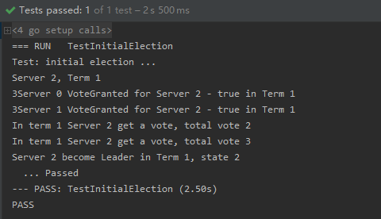

## Assignment 1: Raft Leader Election
> MG1933095 仲奕杰
***

### 简述 Raft
> 主要来自于原论文中

  * Raft 是一种用来**管理日志复制**的**一致性算法**。

  * Raft和 Paxos 的性能和功能是一样的,但是它和 Paxos 的结构不一样,这使得 Raft 更容易理解并且更易于建立实际的系统。 Raft的目标

    + 它必须提供一个完整的、实际的基础来进行系统构建，为的是减少开发者的工作

    + 它必须在所有情况下都能保证安全可用

    + 它对于常规操作必须高效

    + 最重要的目标是：**易于理解**，它必须使得大多数人能够很容易的理解

    + 另外，它必须能让开发者有一个直观的认识，这样才能使系统构建者们去对它进行扩展

  * 为了提高理解性，Raft 将一致性算法分为了几个部分，例如
    + 领导选取`leader selection`

    + 日志复制`log replication`

    + 安全性`safety`

    同时它使用了*更强的一致性*来减少了必须需要考虑的状态。从用户学习的结果来看,Raft 比 Paxos 更容易学会。Raft 还包括了一种新的机制来使得**动态改变集群成员**，它使用重叠大多数`overlapping majorities`来保证安全。

  * Raft有几个新的特性

    + 强领导者`Strong Leader` ：Raft 使用一种比其他算法更强的领导形式。
      > 日志条目只从领导者发送向其他服务器。这样就简化了对日志复制的管理，使得 Raft 更易于理解。

    + 领导选取`Leader Selection` ：Raft 使用随机定时器来选取领导者。
      > 这种方式仅仅是在所有算法都需要实现的心跳机制上增加了一点变化，它使得在解决冲突时更简单和快速。

    + 成员变化`Membership Change` ：Raft 为了调整集群中成员关系使用了新的联合一致性`joint consensus`的方法
      > 这种方法中大多数不同配置的机器在转换关系的时候会交迭overlap。这使得在配置改变的时候，集群能够继续操作。

### Leader Election 分析及设计

  * 我们可以知道Raft系统中，所有的节点有三种情况：**Follower、Candidate、Leader**，并且起始均为**Follower**。如果Follower没有Leader，则会变为Candidate，并向其他节点发起投票，如果多数节点Vote为True则Candidate会变为Leader。

  * 在这其中存在两种timeout，**election timeout、heartbeats timeout**，在Follower状态每个节点开始一个计时器，在达到election timeout时变为Candidate并开始选取Leader。成为Leader后与所有节点保持通信使用heartbeat timeout。

  * 结构体及常数设定

    根据论文中figure2可以得到如下，有些量预先定义但是前面的实验中并不需要使用

    ```go
    type Raft struct {
      mu        sync.Mutex
      peers     []*labrpc.ClientEnd
      persister *Persister
      me        int // index into peers[]

      currentTerm int   // 当前term
      voteFor     int   // 当前candidate编号
      //log []Entry
      //commitIndex int
      //lastApplied int
      //nextIndex   []int
      //matchIndex  []int
      state       int   // 当前状态

      electionTimer *time.Timer   //系统计时器

      Candidate2Follower chan int   // 当candidate变为follower时获取值的channel
      Leader2Follower    chan int   // 当leader变为follower时获取值的channel
      HeartBeatChan      chan int   // 接受每一次heartbeat的channel
    }
    ```
    ```go
    const (
	    Follower  = 0
	    Candidate = 1
	    Leader    = 2   // 系统三种状态

	    HeartBeatsTimer  = time.Duration(50) * time.Millisecond   // heartbeats timeout
	    ElectionTimerMin = 150    // election timeout 下限
	    ElectionTimerMax = 300    // election timeout 上限
    )
    ```

    另外用于接受vote请求和回复以及接受entry请求和回复的结构体定义如下

    ```go
    type RequestVoteArgs struct {
    	// Your data here.
    	Term        int    // 请求所处term值
    	CandidateId int    // 请求成为leader的编号
    	//LastLogIndex int
    	//LastLogTerm int
    }
    type RequestVoteReply struct {
	    // Your data here.
  	  Term        int    // 回复所处term值
  	  VoteGranted bool   // 回复投票结果
    }

    type AppendEntiresArgs struct {
    	Term     int   // 请求所处term值
    	LeaderId int   // 请求Leader的编号
    	//PrevLogIndex int
    	//PrevLogeTerm int
    	//Entries []Entry
    	//LeaderCommit int
    }

    type AppendEntriesReply struct {
    	Term    int    // 回复所处term值
    	Success bool   // 回复结果
    }
    ```

  * 成为Leader流程

    + Follower

      - 没有Leader时，超时开始election

      - 接受Leader时，回复每一个Append Entries

    + Candidate进行投票

      - 如果获得多数成员投票成为Leader

      - 如果发现自身term较低或当前已有Leader则退化为Follower

      - 超时则重新进行election

    + 成为Leader后

      - 发现服务器term更高则退化为Follower

      - 向所有Follower发送Append Entries

  * 主体流程及功能函数

    make函数中首先进行各个参数的初始化，最后一步使用并发执行一个mainLoop函数函数中使用for死循环保证始终执行。
    ```go
      func Make(peers []*labrpc.ClientEnd, me int,
  	    persister *Persister, applyCh chan ApplyMsg) *Raft {  
          ...
          go rf.mainLoop()
          ...
      }

      func (rf *Raft) mainLoop() {
      	for {
      		switch state := rf.state; state {
      		  case Follower:
              follower处理
            case Candidate:
              Candidate处理
            case Leader:
              Leader处理
          }
        }
      }
    ```

    + Follower处理

      ```go
        for {
  				select {
  				case <-rf.electionTimer.C:
  					rf.currentTerm++
  					// fmt.Printf("Server %d, Term %d\n", rf.me, rf.currentTerm)
  					rf.voteFor = -1
  					rf.state = Candidate
  					rf.electionTimer.Reset(randTime())
  					//return
  				}
  				if rf.state == Candidate {
  					break
  				}
  			}
      ```

      通过检测计时器超时触发，使Follower状态变为Candidate并使Term加一，重置计时器。

    + Candidate处理

    ```go
      rf.voteFor = rf.me
      count := 1
      n := len(rf.peers)
      success := make(chan int)
      go func() {
        reply := make(chan *RequestVoteReply)
        for i := 0; i < n; i++ {
          if i != rf.me {
            go func(i int) {
              ...
              return
            }(i)
          }
        }
        for {
          // fmt.Print("in count vote\n")
          ...
        }
      }()
      select {
        case <-success:
          ...
        case <-rf.Candidate2Follower:
          ...
        case <-rf.electionTimer.C:
          ...
      }
    ```

      首先设置成为Candidate的编号和投票对象，开始投票使用一个并发函数，遍历所有节点如果不是Candidate节点则调用RequestVote发送投票请求。接收到投票请求进入计数部分，如果回复Term大于当前Term则重新进行election timeout，将服务器状态恢复为Follower。如果接受到为true的vote则统计数量如果超过半数则将服务器状态设置为Leader。如果投票超时则重置计时器并重新开始投票。


    + Leader处理

    ```go
    func() {
      //n := len(rf.peers)
      heartBeat := time.NewTicker(HeartBeatsTimer)
      defer heartBeat.Stop()
      go func() {
        for _ = range heartBeat.C {
          rf.HeartBeatChan <- 1
        }
      }()
      for {
        select {
        case <-rf.HeartBeatChan:
          n := len(rf.peers)
          for i := 0; i < n; i++ {
            if i != rf.me {
              var reply *AppendEntriesReply
              var args AppendEntiresArgs
              args.Term = rf.currentTerm
              args.LeaderId = rf.me
              go func(i int, args AppendEntiresArgs) {
                rf.peers[i].Call("Raft.AppendEntries", args, &reply)
              }(i, args)
            }
          }
        case <-rf.Leader2Follower:
          rf.state = Follower
          rf.voteFor = -1
          return
        }
      }
    }()
    ```
    由于需要进行heartbeat的循环发送所以这部分需要使用一个私有函数配合`defer heartBeat.Stop()`使用，在状态结束后结束heartbeat的发送。这里不再使用先前的time.Timer计时器，而是使用time.NewTicker计时。因为这种计时器不需要在计时器超时时会自动重新启动而不需要再次Reset。每次收到heartBeat时，由Leader向所有其他节点发送AppendEntries并接受回复。

### 实验演示

  * TestInitialElection

  <center></img></center>

  * TestReElection

  <center></img></center>
