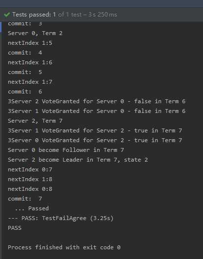
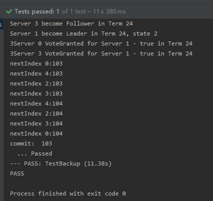

## Assignment 2: Raft Log Consensus
> MG1933095 仲奕杰
***

### 简述 Raft

  于实验一中已描述

### Raft Log Consensus 分析与设计

  * 完善结构体及变量初始化

    在之前实验Leader选取成功后则需要进行log的记录及传播、验证等操作。则需要将先前使用中的**RequestVoteArgs、AppendEntriesArgs、AppendEntriesReply及Raft**中关于log及index记录的变量进行定义及初始化。

  * persist函数准备

    用于系统信息的存取，将当前状态的**currentTerm、voteFor、log**打包为二进制在系统中存取。其中**persist** 负责数据的打包存储，**readpersist** 负责数据的解码读取。

  * Log Consensus

    <center></img></center>

    当选出领导人后，它就开始接收客户端的请求。每一条请求都包含一条需要被复制状态机`replicated state machine`执行的命令。Leader将这条指令作为新的log条目加入到自身的log中，并且向所有Follower发送AppendEntries，要求Follower复制这项指令。当收到多数的Follower已经完成操作后，Leader会将这项指令执行并向客户端返回执行结果。

    - Follower崩溃或丢包等

      Leader会无限制得重试AppendEntries，直到所有的Follower都最终存储了所有Leader的log条目

    - Leader崩溃等

      如果Leader未能及时重连，则需要重新选取Leader，这是并不是所有的Follower都能成为Leader，只有已复制Leader当前所有commit过的log条目的Follower才能够成为Leader

    这种机制保证了Raft日志机制在不同服务器上的一致性。并且保证*如果在不同日志中的两个条目有着相同的term和index号，则它们所存储的命令是相同的*

    - 出现不同服务器中未提交的log

      则需要保证Leader与其的log一致，Leader会要求其寻找到与其日志相同的位置，然后删除该Follower这个位置之后的所有条目

    <center></img></center>

  * 具体实现

    - 在`start`与`make`中需要进行初始化，并在make中添加一个并发执行的用于处理commit操作的函数，将被多数Follower复制的指令打包发送至applyCh并更新lastApplied

      ```go
      go func(){
        for {
          select {
            case <- rf.commitChan:
              index := rf.commitIndex
              for i:=rf.lastApplied+1;i<=index && i<len(rf.log);i++{
                msg := ApplyMsg{Index: i, Command: rf.log[i].Command}
                applyCh <- msg
                rf.lastApplied = i
              }
          }
        }
      }()
      ```
    - 补充Leader处理模块

      首先对各服务器所需求Leader的`nextIndex`及`matchIndex`进行初始化，*这里同时也需要在Candidate模块成功选举Leader后进行相同的操作，否则可能出现奇怪的情况*

      随后添加循环统计各个Follower是否已经复制成功log，如果超过半数则向commitchannel发送信号。

      在接受AppendEntries的回复后对Follower处理，如果成功将它们的log进行符合规则的调整，并设置它们的nextIndex

    - 补充AppendEntries模块

      大多都为if语句，即需要满足论文或上述规则即可

    - 补充RequestVote模块

      这里添加了一条规则，如果原Leader崩溃，新Leader需要限制它的log是跟上当前的commit进程的，所有需要添加
      ```go
        if (args.LastLogTerm < rf.log[len(rf.log)-1].Term)
          || ( (args.LastLogTerm == rf.log[len(rf.log)-1].Term) &&
            (args.LastLogIndex < rf.log[len(rf.log)-1].Index)){
      		reply.VoteGranted = false
      		rf.persist()
      	}
      ```

### 实验结果

  * TestBasicAgree

  <center></img></center>

  * TestFailAgree

  <center></img></center>

  * TestFailNoAgree

  <center></img></center>

  * TestConcurrentStarts

  <center></img></center>

  * TestRejoin

  <center></img></center>

  * TestBackup

  <center></img></center>

  * TestPersist1

  <center></img></center>

  * TestPersist2

  <center></img></center>

  * TestPersist3

  <center></img></center>

### 总结

  * 添加了persist操作后很多地方需要进行存储操作，以及lock和unlock操作，在很多地方需要进行尝试才满足最后的条件

  * 在RequestVote中添加的条件与原先返回True的判断需要添加一个else，否则会导致Rejoin、Backup、persist2等测试不通过

  * 仅通过网页动画展示的Raft流程只能了解一部分Raft机制，通过阅读论文才能够更加深入了解，在通过测试用例时更能准确知道各种情况下系统处理的机制及规则
